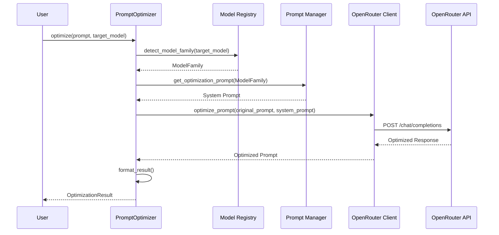
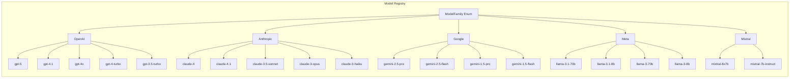
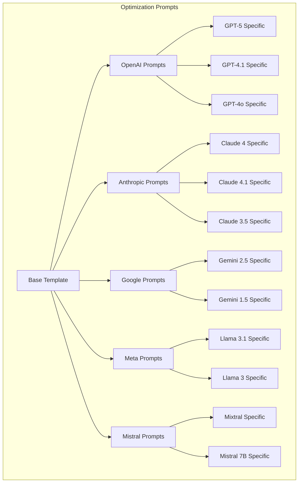
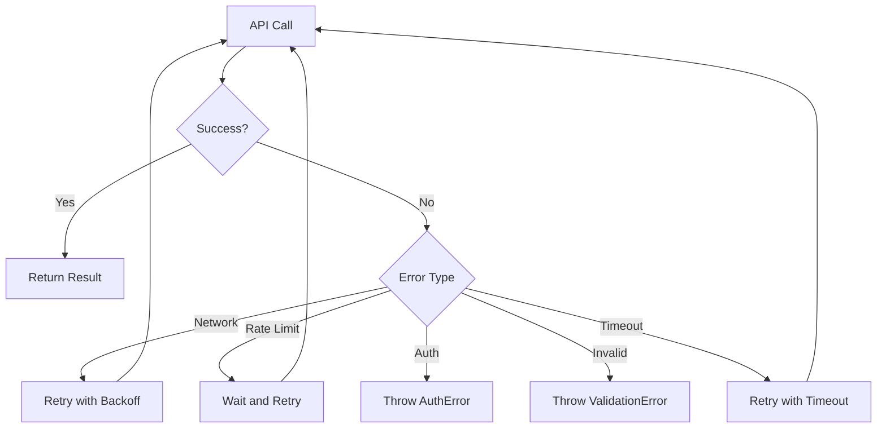
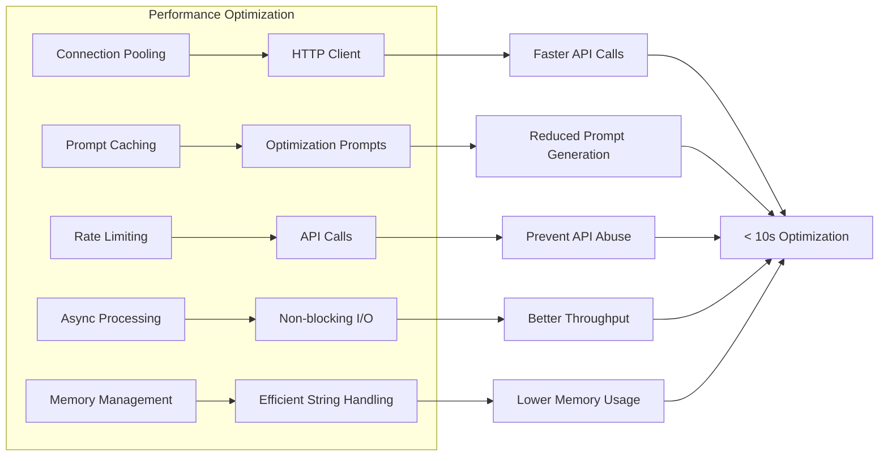

# Prompt Optimizer - System Architecture

## Overview Diagram

```mermaid
graph TB
    subgraph "User Interface Layer"
        A[User Application] --> B[PromptOptimizer API]
    end
    
    subgraph "Core Logic Layer"
        B --> C[Model Registry]
        B --> D[Family Detection]
        B --> E[Prompt Manager]
        B --> F[Result Formatter]
    end
    
    subgraph "External Services"
        E --> G[OpenRouter API]
    end
    
    subgraph "Data Layer"
        C --> H[Model Family Mappings]
        E --> I[Family-Specific Prompts]
    end
    
    subgraph "Supporting Components"
        J[Error Handler] --> B
        K[Rate Limiter] --> G
        L[Logger] --> B
        M[Config Manager] --> B
    end
    
    A -->|optimize()| B
    B -->|detect_family()| D
    D -->|get_family()| C
    C -->|get_mappings()| H
    B -->|get_prompt()| E
    E -->|get_family_prompt()| I
    B -->|call_api()| G
    G -->|response| F
    F -->|result| A
```

## Data Flow Architecture



## Component Breakdown

### 1. Model Registry


### 2. Optimization Prompt System


### 3. Error Handling Flow


## Performance Architecture



## Deployment Architecture

```mermaid
graph TB
    subgraph "Development"
        A[Local Testing] --> B[uv run]
        B --> C[pytest]
        C --> D[Coverage Reports]
    end
    
    subgraph "Package Distribution"
        E[pyproject.toml] --> F[Build Package]
        F --> G[Upload to PyPI]
        G --> H[Pip Installation]
    end
    
    subgraph "Environment Setup"
        I[.env.example] --> J[Environment Variables]
        J --> K[Configuration Management]
        K --> L[Runtime Settings]
    end
    
    subgraph "Documentation"
        M[README.md] --> N[API Reference]
        N --> O[Usage Examples]
        O --> P[Troubleshooting Guide]
    end
```



This architecture provides a comprehensive view of how the Prompt Optimizer system will be structured and how data flows through the various components.