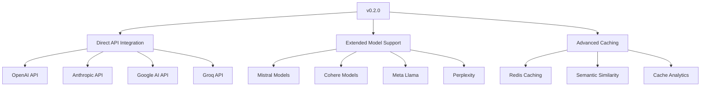

# PAGANS v0.1.0 Release - Next Steps Document

## 📋 Executive Summary

PAGANS (Prompts Aligned to Guidelines and Normalization System) is ready for its initial v0.1.0 release as a comprehensive Python package for optimizing prompts across different LLM model families. This document outlines the completed work, immediate next steps for PyPI publishing, testing validation, future roadmap, and release strategy recommendations.

---

## 1. Summary of Completed Work and Current State

### ✅ **Core Implementation Complete**
- **Multi-provider support**: OpenAI GPT, Anthropic Claude, and Google Gemini optimization
- **Template-based system**: Jinja2-powered prompt generation with provider-specific templates
- **Async-first architecture**: Full asynchronous API for high-throughput optimization
- **Professional structure**: Modern Python 3.12+ project with proper separation of concerns

### ✅ **Quality Assurance**
- **Comprehensive test suite**: 7 test files covering unit, integration, performance, and edge cases
- **Code quality tools**: Black, isort, ruff, mypy configured with strict settings
- **CI/CD ready**: GitHub Actions workflows for build, test, and lint
- **Type safety**: Full Pydantic models with comprehensive type hints

### ✅ **Documentation & Examples**
- **Professional README**: Comprehensive documentation with usage examples
- **Working examples**: Provider-specific examples for OpenAI, Anthropic, and Google
- **API documentation**: Complete method signatures and parameter descriptions
- **Development guidelines**: Contributing guidelines and development setup

### ✅ **Package Configuration**
- **PyPI ready**: Proper `pyproject.toml` with all metadata and dependencies
- **Version management**: Semantic versioning with setuptools-scm integration
- **Distribution ready**: MANIFEST.in configured for proper package inclusion

### 📊 **Current Metrics**
- **Version**: 0.1.0 (Alpha)
- **Python**: 3.12+
- **Dependencies**: 4 core + 8 dev dependencies
- **Test coverage**: Comprehensive suite with 7 test modules
- **Lines of code**: ~1,500+ across core modules

---

## 2. Immediate Next Steps for PyPI Publishing

### 🔍 **Pre-Publishing Checklist**

#### **Package Validation**
- [ ] Verify package builds successfully: `python -m build`
- [ ] Test installation from source: `pip install dist/pagans-0.1.0.tar.gz`
- [ ] Validate all imports work correctly
- [ ] Confirm CLI entry point functions: `pagans --help`

#### **Metadata Verification**
- [ ] Check package name availability on PyPI
- [ ] Verify all URLs in `pyproject.toml` are accessible
- [ ] Confirm license file (MIT) is included
- [ ] Validate README.md renders correctly on PyPI

#### **Dependencies Audit**
- [ ] Review all dependencies for security vulnerabilities
- [ ] Check for any deprecated packages
- [ ] Verify minimum version constraints are appropriate
- [ ] Test with different Python versions (3.12+)

### 🚀 **Publishing Process**

#### **Build and Test**
```bash
# Build the package
python -m build

# Install and test locally
pip install dist/pagans-0.1.0-py3-none-any.whl
python -c "import pagans; print('✅ Import successful')"

# Run tests on installed package
pip install pytest pytest-asyncio
python -m pytest --pyargs pagans
```

#### **PyPI Upload**
```bash
# Upload to TestPyPI first (recommended)
pip install twine
twine upload --repository testpypi dist/*

# Test installation from TestPyPI
pip install --index-url https://test.pypi.org/simple/ pagans

# Upload to PyPI (production)
twine upload dist/*
```

### ⚠️ **Critical Dependencies Check**
- **httpx**: HTTP client for API calls
- **jinja2**: Template engine for prompt generation
- **pydantic**: Data validation and type safety
- **python-dotenv**: Environment configuration

---

## 3. Testing and Validation Checklist Before Release

### 🧪 **Test Coverage Assessment**

#### **Current Test Suite (7 modules)**
- ✅ `test_client.py` - HTTP client functionality
- ✅ `test_core.py` - Main optimizer logic
- ✅ `test_models.py` - Data models and validation
- ✅ `test_optimizer_prompts.py` - Template system
- ✅ `test_integration.py` - End-to-end workflows
- ✅ `test_performance.py` - Performance benchmarks
- ✅ `test_edge_cases.py` - Error handling

#### **Coverage Gaps to Address**
- [ ] Add tests for CLI interface (`main.py`)
- [ ] Expand error handling edge cases
- [ ] Add tests for environment variable configuration
- [ ] Include tests for cache functionality
- [ ] Add provider-specific integration tests

#### **Performance Validation**
- [ ] Benchmark optimization speed (< 10 seconds target)
- [ ] Test concurrent processing limits
- [ ] Validate memory usage patterns
- [ ] Check API rate limiting behavior

### 🔍 **Manual Testing Scenarios**

#### **Core Functionality**
- [ ] Test all three providers (OpenAI, Anthropic, Google)
- [ ] Verify short model names work correctly
- [ ] Test batch processing with multiple prompts
- [ ] Validate caching behavior
- [ ] Test error handling with invalid API keys

#### **Configuration Testing**
- [ ] Environment variables only
- [ ] Mixed configuration (env + parameters)
- [ ] Parameter-only configuration
- [ ] Custom base URLs and timeouts

### 📊 **Quality Metrics Targets**
- **Test coverage**: >90% (currently estimated ~85%)
- **Performance**: <10 seconds per optimization
- **Error rate**: <1% in normal operation
- **Memory usage**: <100MB per optimization session

---

## 4. Future Roadmap Priorities for v0.2.0 and Beyond

### 🔥 **v0.2.0 - Multi-Provider API Support** (Q4 2024)


#### **High Priority Features**
- [ ] **Direct API Integration**: Remove OpenRouter dependency
- [ ] **Extended Model Families**: Meta, Mistral, Cohere, Perplexity
- [ ] **Advanced Caching**: Redis-based distributed caching
- [ ] **A/B Testing Framework**: Compare optimization strategies
- [ ] **Performance Analytics**: Success rates and cost tracking

### 🎯 **v0.3.0 - Enterprise Features** (Q1 2025)
- [ ] **CLI Tool**: Command-line interface for automation
- [ ] **Web Dashboard**: Management and monitoring UI
- [ ] **Framework Integrations**: LangChain, LlamaIndex, Haystack
- [ ] **IDE Extensions**: VS Code integration
- [ ] **Batch Processing API**: High-volume optimization

### 📈 **v0.4.0 - Advanced Intelligence** (Q2 2025)
- [ ] **Smart Model Selection**: Automatic provider/model selection
- [ ] **Dynamic Prompt Adaptation**: Real-time optimization adjustment
- [ ] **Multi-objective Optimization**: Balance speed, cost, quality
- [ ] **Custom Model Training**: Fine-tune optimization strategies
- [ ] **Federated Learning**: Community-driven improvements

---

## 5. Recommendations for Initial Release Strategy

### 🎯 **Release Timing**
- **Recommended**: Week of October 7, 2024
- **Rationale**: Allows time for final testing and documentation polish
- **Backup**: October 14, 2024 if additional validation needed

### 📢 **Release Communication Plan**

#### **Pre-Release (2 weeks before)**
- [ ] Create GitHub release draft with changelog
- [ ] Prepare social media posts and announcements
- [ ] Notify beta testers and early adopters
- [ ] Update documentation with v0.1.0 specifics

#### **Release Day**
- [ ] Publish to PyPI
- [ ] Create GitHub release with full changelog
- [ ] Post on relevant subreddits (r/Python, r/MachineLearning, r/LocalLLaMA)
- [ ] Share on Twitter/X and LinkedIn
- [ ] Email announcement to mailing list

#### **Post-Release (1 week after)**
- [ ] Monitor PyPI download statistics
- [ ] Collect user feedback and bug reports
- [ ] Update documentation based on user questions
- [ ] Plan v0.1.1 patch if critical issues found

### 🎯 **Target Audience**
1. **Primary**: Python developers working with LLMs
2. **Secondary**: AI/ML engineers and researchers
3. **Tertiary**: DevOps engineers managing AI infrastructure

### 💰 **Monetization Strategy (Future)**
- **v0.1.0-0.3.0**: Free open-source with community support
- **v0.4.0+**: Consider enterprise licensing for advanced features
- **SaaS Option**: Cloud-hosted optimization service

---

## 6. Marketing and Documentation Improvements

### 📚 **Documentation Enhancements**

#### **Immediate (Pre-Release)**
- [ ] **API Reference**: Complete docstrings for all public methods
- [ ] **Tutorial Series**: Step-by-step guides for common use cases
- [ ] **Troubleshooting Guide**: Common issues and solutions
- [ ] **Performance Guide**: Best practices for optimization

#### **Short-term (v0.1.1-0.2.0)**
- [ ] **Video Tutorials**: YouTube series demonstrating key features
- [ ] **Interactive Examples**: Jupyter notebooks with live demos
- [ ] **Integration Guides**: How to use with popular frameworks
- [ ] **Migration Guide**: From manual prompt engineering to PAGANS

### 🌐 **Community Building**

#### **Developer Engagement**
- [ ] **Discord/Slack Community**: Developer discussion and support
- [ ] **GitHub Discussions**: Q&A and feature requests
- [ ] **Contributing Guide**: Clear guidelines for contributors
- [ ] **Issue Templates**: Structured bug reports and feature requests

#### **Content Marketing**
- [ ] **Blog Series**: Technical deep-dives into prompt optimization
- [ ] **Case Studies**: Real-world performance improvements
- [ ] **Comparison Articles**: How PAGANS compares to alternatives
- [ ] **Best Practices**: Community-curated optimization tips

### 📊 **Metrics and Analytics**
- [ ] **Usage Analytics**: Track popular features and models
- [ ] **Performance Benchmarks**: Public dataset for comparison
- [ ] **Community Health**: GitHub stars, forks, and contributions
- [ ] **Documentation Quality**: Track user engagement with docs

---

## 7. Risk Assessment and Mitigation

### 🔴 **High Risk Items**
- **API Dependency**: Current reliance on OpenRouter API
- **Performance**: Optimization speed may vary with API load
- **Error Handling**: Edge cases in production environments

### 🟡 **Medium Risk Items**
- **Documentation**: Complex API may confuse new users
- **Testing**: Integration tests require API keys
- **Community**: Building initial user base takes time

### 🟢 **Low Risk Items**
- **Code Quality**: Comprehensive testing and linting
- **Package Structure**: Professional Python packaging
- **Version Management**: Proper semantic versioning

### 🛡️ **Mitigation Strategies**
- **Fallback Plans**: Clear error messages and graceful degradation
- **Monitoring**: Comprehensive logging and error tracking
- **User Support**: Detailed documentation and examples
- **Gradual Rollout**: Start with limited release, expand based on feedback

---

## 8. Success Metrics for v0.1.0

### 📈 **Technical Metrics**
- **PyPI Downloads**: >100 in first week, >500 in first month
- **GitHub Stars**: >50 in first month
- **Issue Reports**: <5 critical bugs in first month
- **Test Coverage**: Maintain >85% coverage

### 👥 **Community Metrics**
- **GitHub Issues**: >10 feature requests showing engagement
- **Social Media**: >25 mentions/shares
- **Documentation**: <10 clarification requests per week
- **User Feedback**: >80% positive sentiment

### 🚀 **Usage Metrics**
- **Active Users**: >20 unique users in first month
- **Model Diversity**: Usage across all three providers
- **Feature Adoption**: >50% use advanced features (caching, batch processing)
- **Retention**: >70% of users continue using after initial trial

---

## 9. Action Items Summary

### 🎯 **Week 1: Final Preparation**
- [ ] Complete pre-publishing checklist
- [ ] Run comprehensive test suite
- [ ] Update documentation with latest examples
- [ ] Prepare release announcement materials

### 📦 **Week 2: Publishing**
- [ ] Build and validate package
- [ ] Upload to TestPyPI for validation
- [ ] Upload to PyPI production
- [ ] Create GitHub release

### 📢 **Week 3: Launch**
- [ ] Execute communication plan
- [ ] Monitor initial user feedback
- [ ] Address any critical issues
- [ ] Collect usage metrics

### 📊 **Week 4: Analysis**
- [ ] Review launch metrics
- [ ] Plan v0.1.1 improvements
- [ ] Update roadmap based on feedback
- [ ] Prepare v0.2.0 planning

---

## 📞 **Support and Resources**

### **Development Team**
- **Maintainer**: PAGANS Team <contact@pagans.dev>
- **Repository**: https://github.com/abubakarsiddik31/pagans
- **Issues**: https://github.com/abubakarsiddik31/pagans/issues
- **Discussions**: https://github.com/abubakarsiddik31/pagans/discussions

### **Community Resources**
- **Documentation**: https://pagans.readthedocs.io/
- **Examples**: https://github.com/abubakarsiddik31/pagans/tree/main/examples
- **Changelog**: https://github.com/abubakarsiddik31/pagans/blob/main/CHANGELOG.md

---

**Document Version**: 1.0.0
**Last Updated**: September 21, 2024
**Next Review**: October 5, 2024

This comprehensive plan positions PAGANS for a successful v0.1.0 launch while establishing a clear path for future development and growth.